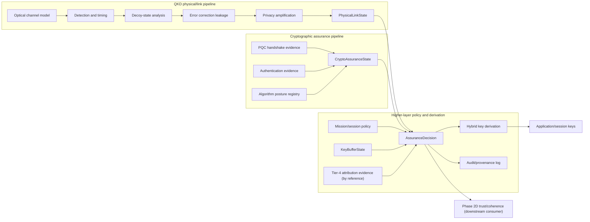

# Incorporating PQC into the Quantum-QKD-Aero Architecture

## Summary

Quantum-QKD-Aero should incorporate post-quantum cryptography (PQC) as a higher-layer assurance and key-establishment component alongside QKD-derived key material. PQC should not be inserted into the QKD physics, channel, decoy-state, error-correction, or privacy-amplification modules.

The architectural rule is:

> QKD physical link state and PQC cryptographic assurance state are separate evidence streams. They may be combined by policy and key-derivation layers, but they must not be collapsed inside the physics model.

This gives the project three useful properties:

1. It preserves the scientific meaning of QKD observables such as QBER, decoy yields, photon-number-splitting suspicion, sifted-key rate, and finite-key margins.
2. It allows the system to benefit from standardized PQC algorithms such as ML-KEM, ML-DSA, and SLH-DSA without making QKD security depend on lattice assumptions.
3. It creates assumption agility: if PQC guidance changes, the cryptographic posture can be updated without rewriting the physical link model.

## Design Decision

Add a higher-layer `HybridKeyAndAssurance` boundary above the QKD link pipeline.



The QKD modules should output evidence about the physical exchange. PQC modules should output evidence about cryptographic handshakes, algorithm status, implementation status, authentication status, and transcript binding. A policy layer decides whether the resulting key material is acceptable for a given mission or session.

## Rationale for Hybrid QKD+PQC

QKD and PQC defend against different failure classes.

QKD is valuable because it ties secrecy to measured physical behavior of a link. If the observed link indicates excessive information leakage, the system can refuse to generate key material or sharply reduce the secure-key estimate. This is especially important in aerospace settings where channel loss, pointing error, turbulence, platform motion, timing drift, and adversarial optical manipulation can affect the link.

PQC is valuable because it works over ordinary digital networks and can authenticate or establish keys even when the optical QKD link is unavailable, degraded, intermittent, or not yet acquired. It also aligns the project with standardized cryptographic deployment paths, especially NIST's FIPS 203 ML-KEM key-establishment standard and the FIPS 204/FIPS 205 digital-signature standards.

The hybrid architecture should therefore use both:

- QKD contributes physically-derived symmetric entropy when the optical link is healthy enough.
- PQC contributes computationally-derived key-establishment and authentication evidence using standardized, replaceable algorithms.
- The policy layer records which components contributed to each session key and what assumptions were active at the time.

The main benefit is not that QKD "fixes" PQC or that PQC "fixes" QKD. The benefit is failure-mode diversity with explicit provenance.

## Strict Separation of State

The project should maintain separate state objects for physical link evidence and cryptographic assurance evidence.

### Physical link state

`PhysicalLinkState` is derived from the QKD pipeline only. It should describe what happened on the optical or quantum channel and during QKD post-processing.

Examples:

- Link identity, peer identity as observed by the link layer, and epoch.
- QBER and basis-specific error rates.
- Sifted-key rate and secure-key-rate estimate.
- Decoy-state yields, vacuum/single-photon estimates, and photon-number-splitting suspicion.
- Detector health, timing-window anomalies, dark-count assumptions, visibility, loss, pointing stability, and atmospheric/free-space channel estimates.
- Error-correction leakage.
- Privacy-amplification parameters.
- Finite-key security parameters.
- Physical-link disposition: `healthy`, `degraded`, `suspect`, `failed`, or `unknown`.
- A reference (never an embedded copy) to the tier-4-owned `DegradationAttributionEvidence` object for the current window; tier 4 is the single attribution authority, and `PhysicalLinkState` carries only the reference and digest.

This state must not say that a PQC algorithm is approved, deprecated, broken, or under review. Those are cryptographic-assumption facts, not physical-link facts.

### Cryptographic assurance state

`CryptoAssuranceState` is derived from protocol, algorithm, implementation, authentication, and advisory evidence.

Examples:

- PQC KEM suite: for example `ML-KEM-768` or project-approved alternatives.
- PQC signature suite: for example `ML-DSA` or `SLH-DSA` where signatures are needed.
- Library, implementation, version, provider, and validation posture.
- Peer credential chain, identity binding, and allowed trust anchors.
- Handshake transcript hash.
- Algorithm posture: `approved`, `watched`, `contested`, `deprecated`, or `disallowed`.
- Advisory references and review dates.
- Authentication status for the classical QKD channel and higher-layer handshake.

This state must not infer that the optical link was physically clean. A successful PQC handshake does not lower QBER, remove detector anomalies, or validate decoy-state assumptions.

### Combined assurance state

`AssuranceDecision` is the first place where these streams may be combined. The decision should carry evidence references rather than replacing them with a single opaque score.

Recommended properties:

- Keep the physical and cryptographic status fields visible in every decision.
- Make the issuance mode, disposition, and required actions each explicit; no single label is authoritative alone.
- Record which key inputs were selected via `selected_input_refs`; the issuance mode and the selected handles must agree.
- Bind the decision to a policy version and transcript hash.
- Emit audit records for every downgrade, fallback, block, and algorithm-status change.

## Proposed Higher-Layer Inputs and Outputs

### Inputs

The higher-layer hybrid service should consume these inputs:

| Input | Source | Purpose |
| --- | --- | --- |
| `PhysicalLinkState` | QKD pipeline | Describes physical-channel and QKD post-processing health. |
| `QkdKeyCandidate` | QKD privacy-amplification output | Provides QKD-derived key material and provenance when the link is acceptable. |
| `PqcHandshakeEvidence` | PQC handshake adapter | Describes KEM/signature choices, transcript binding, peer identity, and handshake result. |
| `AuthenticationEvidence` | Classical-channel authentication layer | Confirms whether the QKD classical channel and session control traffic were authenticated. |
| `AlgorithmPosture` | Cryptographic posture registry | Encodes current policy status for algorithms, parameters, implementations, and advisories. |
| `MissionPolicy` | Mission/session configuration | Defines whether hybrid, QKD-only, or PQC-only operation is permitted. |
| `KeyBufferState` | Key manager / buffer monitor | Describes QKD key-buffer fill, consumption rate, projected depletion against the contact-window schedule, and depletion-rate anomalies. |
| `DegradationAttributionEvidence` | Adaptive-coupling tier (ADR-0004) monitoring | Single-authority, immutable attribution evidence: a consistency verdict (`environment_consistent`, `unexplained`, `adversarial_suspected`, `insufficient_evidence`) with confidence, observation window, monitor/model version, committed-reference digest, and source-integrity/independence/freshness assessments. Referenced (never duplicated) by `PhysicalLinkState`. |

### Outputs

The service should emit:

| Output | Consumer | Purpose |
| --- | --- | --- |
| `AssuranceDecision` | Session manager, trust layer, audit log | Carries the orthogonal result: exactly one `KeyIssuanceMode`, exactly one `AssuranceDisposition`, zero or more `RequiredAction`s, plus selected input references and evidence references. |
| `HybridKeyMaterial` | Application/session key manager | Provides labeled derived keys, never raw QKD or raw PQC secrets. |
| `KeyProvenanceRecord` | Audit and reproducibility layer | Records source inputs, algorithms, policy version, transcript hash, and evidence digests. |
| `RequiredAction` set | Orchestration layer | Zero or more follow-up commands (rekey, rotate algorithm, quarantine link, require human review); issuance and disposition live in `AssuranceDecision` and are never inferred from actions. |
| `AssumptionUpdateEvent` | Cryptographic posture registry | Captures changes in PQC confidence, implementation status, or deprecation state. |

## Assumption Agility

PQC assumptions must be treated as mutable architecture inputs. The architecture should expect algorithms and implementation guidance to change.

Recommended approach:

- Maintain an `AlgorithmPostureRegistry` outside the QKD physics modules.
- Version every algorithm suite and posture decision.
- Separate algorithm status from implementation status. An algorithm may remain approved while a specific library version is disallowed.
- Include effective dates, review dates, advisory links, and reviewer approval in posture records.
- Use policy gates rather than code edits to move algorithms between `approved`, `watched`, `deprecated`, and `disallowed`.
- Support multiple suites so the project can migrate without changing evidence schemas.
- Log the suite used for every derived session key.
- Implement `AlgorithmPostureRegistry` following the project's D3 registry pattern (LINK-1): an independent registry with a mandatory CI consistency test, not a convention local to this module.

Example posture categories:

| Status | Meaning | Default action |
| --- | --- | --- |
| `approved` | Accepted for current project policy. | Permit if authentication and policy requirements pass. |
| `watched` | Still usable, but under active monitoring or pending review. | Permit only if mission policy allows watched algorithms; increase audit detail. |
| `contested` | Significant unresolved concern, proof gap, implementation concern, or active standards debate. | Block for high-assurance missions; allow only explicit research-mode override. |
| `deprecated` | Scheduled for removal or no longer recommended. | Deny new sessions except migration workflows. |
| `disallowed` | Known compromise, invalid parameter set, or banned implementation. | Block use immediately. |

## Authentication Dependency

QKD does not remove the need for authentication. BB84-style QKD and related protocols require an authenticated classical channel; otherwise, an active attacker can mediate separate exchanges and defeat the intended identity binding.

Quantum-QKD-Aero should model authentication as its own assurance dependency:

- The QKD physical link may be optically healthy while the classical channel is unauthenticated. That must not produce usable mission keys.
- PQC signatures or PQC-authenticated handshakes may help authenticate peers, but their assurance belongs to `CryptoAssuranceState`.
- Pre-shared symmetric authentication keys may be used for initial QKD bootstrapping if that is part of the project threat model.
- QKD-derived or hybrid-derived keys may refresh authentication keys after a successfully authenticated session.
- Authentication failure should block new key acceptance even when both QKD metrics and PQC KEM completion look good.

The policy layer should therefore consider at least three gates:

1. Physical QKD link acceptability.
2. PQC algorithm and handshake acceptability.
3. Authentication acceptability.

The third gate is not optional.

## Adaptive-Coupling Tier Integration and Induced-Degradation Threats

ADR-0004 defines a fourth architectural tier above the three channel-effect tiers of ADR-0003: the adaptive-coupling tier, which owns every feedback path in which channel-state observables drive protocol or policy adaptation. The hybrid policy layer described in this note is a client of that tier and inherits its threat model.

### The core threat: forced fallback through the physical layer

`PhysicalLinkState` is not honest telemetry. Its inputs originate on the untrusted side of the estimator boundary, and an adversary with channel access can shape them. This creates a downgrade attack that never touches cryptography:

1. The adversary induces apparent channel degradation (turbulence-mimicking fades, pointing interference, background injection) sufficient to drive `physical_status` to `degraded` or `failed`.
2. The policy engine responds as designed: the QKD contribution is blocked and, where mission policy permits, the session falls back to `pqc_only` issuance.
3. The adversary now faces only the computational leg, at leisure, while every audit record shows a policy engine behaving correctly.

The attack is an instance of monitored-feedback capture: the adversary steers the system through its own adaptation loop by shaping the observable the loop consumes. It must be treated as a first-class scenario, not an edge case.

### Required mitigations

- **Attribution, not just status — and consistency, not cause.** Physical degradation must carry an attribution verdict from the adaptive-coupling tier's monitoring: `environment_consistent`, `unexplained`, `adversarial_suspected`, or `insufficient_evidence`. Verdicts are operational classifications, not proofs of cause or absence of attack: `environment_consistent` means only that the observation is compatible with the committed reference model, and an attacker may deliberately produce an environment-consistent trace. No verdict establishes absence of adversarial influence. The verdict travels as a single-authority, immutable evidence object (verdict, confidence, observation window, production time, monitor and model version, committed-reference identifier and digest, source-integrity/source-independence/freshness assessments, reason codes); `PhysicalLinkState` carries only a reference to it. A verdict may be strengthened by an independent sensor only when both the cryptographic integrity of the sensor report and its causal independence from the challenged optical path are separately established — distinct properties that must never be collapsed into one trusted flag. `insufficient_evidence`, stale attribution, and missing attribution all fail closed for high-assurance fallback; emergency continuation exists only as an explicit mission-policy exception with its own audit label and authorization rule.
- **Fallback hysteresis and rate limiting.** Transitions into `pqc_only` issuance triggered by degradation must be rate-limited per link and per mission window. Exceeding a configured threshold escalates automatically.
- **Escalation over accommodation.** Repeated, statistically anomalous, or unattributed degradation-triggered fallbacks escalate to `quarantine_link` or `require_human_review`. The system must never settle silently into PQC-only operation on a link whose degradation is unexplained.
- **Fallback-recovery asymmetry.** Returning from `pqc_only` issuance to hybrid operation requires a full re-evaluation with fresh evidence, not merely the physical status returning to `healthy`; an adversary who can induce degradation can also end it on cue.

### Key-buffer depletion as an attack path

Because QKD key material arrives in contact-window-gated epochs while consumption is continuous, fallback in operation is usually driven by buffer depletion rather than instantaneous link state. Depletion is therefore an indirect target: an adversary who suppresses key generation across one or more contact windows produces a "legitimate" buffer-driven downgrade later, decoupled in time from the induced fades. The policy engine must consume `KeyBufferState` (fill level, consumption rate, projected depletion time against the contact-window schedule, and depletion-rate anomaly flags) and apply the same attribution and escalation logic to buffer-driven fallbacks as to status-driven ones.

## Hybrid Key Derivation Concepts

The key combiner should be a narrow, well-reviewed module. It should not expose raw QKD or PQC shared secrets to application code.

Recommended concept:

1. Obtain `qkd_secret` only from a QKD epoch that passed physical-link policy.
2. Obtain `pqc_secret` only from a PQC handshake that passed cryptographic and authentication policy.
3. Bind both inputs to the same session transcript, peer identity, algorithm suite, mission context, and epoch.
4. Feed the accepted inputs into a standard KDF such as HKDF or another project-approved extractor.
5. Emit labeled traffic keys and rekey material through the session key manager.

Illustrative derivation only (non-normative; not approved for implementation):

```text
salt = H(
  "Quantum-QKD-Aero hybrid salt v1" ||
  session_transcript_hash ||
  mission_context_id ||
  link_id ||
  qkd_epoch_id ||
  pqc_suite_id ||
  policy_version
)

hybrid_extract = HKDF-Extract(
  salt,
  encode("qkd", qkd_key_id, qkd_secret) ||
  encode("pqc", pqc_key_id, pqc_secret)
)

traffic_key = HKDF-Expand(
  hybrid_extract,
  "Quantum-QKD-Aero traffic key v1" ||
  peer_id ||
  direction ||
  key_purpose,
  length
)
```

Implementation guidance:

- Do not XOR raw secrets as the primary design unless a reviewed protocol profile specifically requires it.
- Use domain separation labels for every derived key purpose.
- Include algorithm identifiers and policy versions in the transcript-bound context.
- Use length-prefixing or structured encoding for all KDF inputs.
- Support the `MissionPolicyProfile` values: `hybrid_required`, `qkd_preferred`, `pqc_fallback_allowed`, and `research_mode`.
- Fail closed when an input is marked present but its evidence is missing, stale, or mismatched.
- The KDF accepts only the input handles named in `AssuranceDecision.selected_input_refs` under an explicit `issuance_mode`; it never infers inputs from status fields, and `disposition=degraded` alone authorizes nothing.
- Prefer standardized protocol combiners where available; avoid inventing new cryptographic protocols.
- The "secure if at least one input remains secret" goal is not automatically supplied by a generic KDF over concatenated secrets. NIST SP 800-227's composite-KEM security considerations warn that a straightforward KDF(K1, K2) does not generically preserve IND-CCA security regardless of the KDF, and recommend combiners that bind the component public inputs (ciphertexts, encapsulation keys, identities, parameter sets) and a domain separator; SP 800-56C rev. 2 supplies the approved KDF constructions. The illustrative derivation above is non-normative and not approved for implementation. Stage 3 must select an exact reviewed construction, state the concrete security property it targets with citation (verifying the precise SP 800-227 section reference at that time), and — where a transcript hash stands in for the bound public inputs — specify and test its canonical coverage and encoding.

The security claim should be phrased conservatively:

> The hybrid derivation is intended to preserve confidentiality if at least one accepted input remains secret and the KDF is used correctly. This is a design goal, not a substitute for protocol review.

## Policy Result Model

The policy layer must produce a result whose fields are orthogonal, so that key issuance is uniquely determined. v2's single `PolicyAction` enum mixed key-contribution mode, assurance disposition, and follow-up commands, leaving outcomes such as `degrade_session` and `rekey` ambiguous about which key inputs the KDF may consume. v3 splits the result:

- **`KeyIssuanceMode`** — which inputs the KDF is authorized to consume: `hybrid`, `qkd_only`, `pqc_only`, or `none`. The KDF accepts only the input handles named in `selected_input_refs`; it never infers inputs from status fields.
- **`AssuranceDisposition`** — the session's assurance label: `assured`, `degraded`, `held`, `blocked`, or `research_only`.
- **`RequiredAction`** — zero or more follow-up commands: `rekey`, `rotate_algorithm`, `quarantine_link`, `require_human_review`.

Representative mappings from the superseded v2 actions:

| v2 action | v3 result |
| --- | --- |
| `accept_hybrid` | `issuance_mode=hybrid`, `disposition=assured` |
| `accept_qkd_only` | `issuance_mode=qkd_only`, `disposition=assured` |
| `accept_pqc_only` | `issuance_mode=pqc_only`, `disposition=assured` or `degraded` per policy |
| `degrade_session` | explicit `issuance_mode` required; `disposition=degraded` |
| `rekey` | disposition unchanged; `required_actions` includes `rekey`, with an explicit `issuance_mode` for the new material |
| `hold_keys` | `issuance_mode=none`, `disposition=held` |
| `quarantine_link` | `issuance_mode=none`, `disposition=blocked`, `required_actions` includes `quarantine_link` and `require_human_review` |
| `rotate_algorithm` | `required_actions` includes `rotate_algorithm`; issuance set by re-evaluation |
| `require_human_review` | `disposition=held` or `blocked`; `required_actions` includes `require_human_review` |
| `block` | `issuance_mode=none`, `disposition=blocked` |

Structural invariants (schema-enforced and tested):

- Every policy result carries exactly one `issuance_mode` and exactly one `disposition`.
- `disposition=blocked` or `disposition=held` implies `issuance_mode=none`.
- `disposition=research_only` never issues mission keys.
- A `MissionPolicy` `hybrid_required` profile is incompatible with single-source issuance modes; the combination is a schema error, not a runtime fallback.
- `disposition=degraded` reaching the KDF requires an explicit `issuance_mode`; `degraded` alone authorizes nothing.

Default high-assurance policy (v3 vocabulary):

- `physical=healthy`, `crypto=approved`, `auth=valid` in both required scopes: `issuance_mode=hybrid`, `disposition=assured`.
- `physical=suspect` or `physical=failed`: QKD contribution excluded; `issuance_mode=pqc_only` only where the mission profile explicitly permits it and attribution evidence passes the fail-closed rules below; otherwise `issuance_mode=none`, `disposition=held`.
- `crypto=deprecated` or `crypto=disallowed`: PQC contribution excluded; `qkd_only` requires independently valid authentication.
- `auth=invalid` or `auth=unknown` in either required scope: `issuance_mode=none`, `disposition=blocked`.
- Any required evidence missing, stale, or unresolvable: `issuance_mode=none`, `disposition=held`.
- Degradation-triggered transitions to `pqc_only` issuance are rate-limited per link and mission window; exceeding the threshold adds `quarantine_link` or `require_human_review` to `required_actions`.
- Degradation with attribution `unexplained`, `adversarial_suspected`, or `insufficient_evidence` — or with stale or missing attribution evidence — never authorizes `pqc_only` mission keys. Emergency continuation exists only as an explicit mission-policy exception object with its own audit label and authorization rule.
- Recovery from `pqc_only` issuance to hybrid requires fresh full evidence re-evaluation, not merely restored physical status.
- No attribution verdict establishes absence of adversarial influence; `environment_consistent` is a consistency classification against the committed reference, never proof of benign cause.

## Failure-Mode Diversity

The architecture should preserve diversity rather than hiding it.

QKD-dominant failure modes include:

- Channel loss, turbulence, pointing error, timing drift, and platform motion.
- Detector blinding, calibration abuse, side channels, and implementation mismatch.
- Photon-number-splitting risk in weak-coherent-pulse regimes.
- Excess leakage during error correction or incorrect finite-key accounting.
- Inaccurate physical assumptions in simulation or parameter estimation.

PQC-dominant failure modes include:

- Cryptanalytic progress against an algorithm family or parameter set.
- Broken, misconfigured, or non-validated implementation.
- Downgrade attacks during algorithm negotiation.
- Bad randomness or side-channel leakage in the digital stack.
- Credential-chain compromise or stale trust anchors.

Shared or coupling failure modes include:

- Authentication failure on the classical channel.
- Policy misconfiguration.
- Transcript binding errors.
- Incorrect identity binding between the QKD peer and PQC peer.
- Audit gaps that make assurance claims unreproducible.

The policy engine should not interpret a clean QKD physical state as proof that PQC assumptions are sound, and it should not interpret an approved PQC handshake as proof that the QKD link was physically secure.

## Threat and Assurance Status Model

Use a multi-axis model rather than a single security score.

### Physical axis

| State | Meaning |
| --- | --- |
| `healthy` | QKD metrics are within policy limits and evidence is current. |
| `degraded` | Link can operate but has reduced rate, tighter margins, or warning-level anomalies. |
| `suspect` | Attack indicators or unexplained anomalies are present. |
| `failed` | Physical or post-processing policy failed. |
| `unknown` | Evidence is missing, stale, or not comparable to policy. |

### Cryptographic-assumption axis

| State | Meaning |
| --- | --- |
| `approved` | Algorithm, parameters, and implementation are acceptable under current policy. |
| `watched` | Still allowed but under active review or enhanced logging. |
| `contested` | Material concern exists; high-assurance use should stop pending review. |
| `deprecated` | Not acceptable for new ordinary sessions. |
| `disallowed` | Must not be used. |
| `unknown` | Registry or evidence is missing. |

### Authentication axis

| State | Meaning |
| --- | --- |
| `valid` | Peer identity and classical-channel authentication passed. |
| `valid_with_warning` | Accepted but has non-blocking warnings, such as near-expiry credentials. |
| `expired` | Credential, key, or assertion is out of policy window. |
| `invalid` | Authentication failed. |
| `unknown` | Authentication evidence is missing or stale. |

### Issuance and disposition axes

The single decision axis of v2 is replaced by the orthogonal `KeyIssuanceMode` and `AssuranceDisposition` fields defined in "Policy Result Model." A decision is the pair (issuance mode, disposition) plus zero or more required actions; no single label is authoritative on its own, and every combination outside the structural invariants is unrepresentable or rejected.

## Integration with Phase 2D Trust/Coherence

Phase 2D trust/coherence is strictly downstream of the policy boundary: it consumes the separated evidence streams and `AssuranceDecision` outputs, and it never acts as an input or gate to `AssuranceDecision` evaluation. (v1 listed `Phase2DTrustContext` as a hybrid-service input while also routing `AssuranceDecision` to the trust layer, creating a policy-trust feedback loop with undefined evaluation order; resolved in v2 by making Phase 2D a consumer and explainer only.)

Recommended integration points:

- Add `crypto_assumption_state` as a first-class trust input.
- Add `authentication_state` as a first-class trust input.
- Add `key_provenance_digest` to tie a trust decision to the exact QKD epoch, PQC transcript, algorithm posture, and policy version.
- Add coherence checks that verify peer identity consistency across QKD link metadata, PQC credentials, mission session identity, and audit records.
- Keep physical coherence and cryptographic coherence distinct until the policy decision boundary.
- Make Phase 2D responsible for explaining cross-evidence decisions, not for mutating low-level QKD metrics.

Example Phase 2D coherence questions:

- Does the QKD peer identity map to the same mission peer authenticated by PQC credentials?
- Are the QKD epoch, PQC handshake transcript, and session key identifier bound to the same session?
- Did a PQC posture change occur after a key was derived, and does policy require rekeying?
- Is the QKD physical state degraded with current attribution evidence classified as `environment_consistent`, and does mission policy explicitly permit digital fallback without treating that verdict as proof of benign cause?
- Is QKD physically healthy while authentication is invalid, requiring a hard block?

Phase 2D should treat these as evidence relationships. It should not rewrite the evidence itself.

## Non-Goals

This design note does not propose:

- Putting PQC algorithms inside QKD physics, channel, detector, decoy-state, QBER, error-correction, or privacy-amplification modules.
- Treating PQC algorithm approval as a physical QKD observable.
- Treating QKD link health as proof of peer identity.
- Treating QKD as a replacement for authentication.
- Designing a new PQC primitive or custom signature scheme.
- Claiming that current standardized PQC has been broken.
- Relying on one scalar security score without preserving evidence provenance.
- Promoting untrusted external research or conversation content into official project context without human approval.

## Suggested Schema and Dataclasses

The exact code style should follow the existing repository, but the core data boundaries should resemble the following.

```python
from dataclasses import dataclass, field
from enum import Enum
from typing import Mapping


class PhysicalLinkStatus(str, Enum):
    HEALTHY = "healthy"
    DEGRADED = "degraded"
    SUSPECT = "suspect"
    FAILED = "failed"
    UNKNOWN = "unknown"


class PnsSuspicionLevel(str, Enum):
    NONE = "none"
    ELEVATED = "elevated"
    HIGH = "high"
    UNKNOWN = "unknown"


class AttributionVerdict(str, Enum):
    ENVIRONMENT_CONSISTENT = "environment_consistent"
    UNEXPLAINED = "unexplained"
    ADVERSARIAL_SUSPECTED = "adversarial_suspected"
    INSUFFICIENT_EVIDENCE = "insufficient_evidence"
    NOT_APPLICABLE = "not_applicable"


class AuthenticationScope(str, Enum):
    QKD_CLASSICAL_CHANNEL = "qkd_classical_channel"
    SESSION_CONTROL = "session_control"


class CryptoPostureStatus(str, Enum):
    APPROVED = "approved"
    WATCHED = "watched"
    CONTESTED = "contested"
    DEPRECATED = "deprecated"
    DISALLOWED = "disallowed"
    UNKNOWN = "unknown"


class AuthenticationStatus(str, Enum):
    VALID = "valid"
    VALID_WITH_WARNING = "valid_with_warning"
    EXPIRED = "expired"
    INVALID = "invalid"
    UNKNOWN = "unknown"


class KeyIssuanceMode(str, Enum):
    HYBRID = "hybrid"
    QKD_ONLY = "qkd_only"
    PQC_ONLY = "pqc_only"
    NONE = "none"


class AssuranceDisposition(str, Enum):
    ASSURED = "assured"
    DEGRADED = "degraded"
    HELD = "held"
    BLOCKED = "blocked"
    RESEARCH_ONLY = "research_only"


class RequiredAction(str, Enum):
    REKEY = "rekey"
    ROTATE_ALGORITHM = "rotate_algorithm"
    QUARANTINE_LINK = "quarantine_link"
    REQUIRE_HUMAN_REVIEW = "require_human_review"


class MissionPolicyProfile(str, Enum):
    HYBRID_REQUIRED = "hybrid_required"
    QKD_PREFERRED = "qkd_preferred"
    PQC_FALLBACK_ALLOWED = "pqc_fallback_allowed"
    RESEARCH_MODE = "research_mode"


@dataclass(frozen=True)
class PhysicalLinkState:
    link_id: str
    epoch_id: str
    observed_at_utc: str
    qber: float
    sifted_key_rate_bps: float
    secure_key_rate_bps: float
    decoy_pns_suspicion: PnsSuspicionLevel
    finite_key_epsilon: float
    error_correction_leakage_bits: int
    privacy_amplification_id: str
    session_id: str
    peer_id: str
    status: PhysicalLinkStatus
    attribution_evidence_ref: str | None
    evidence_refs: tuple[str, ...] = ()


@dataclass(frozen=True)
class KeyBufferState:
    link_id: str
    observed_at_utc: str
    buffer_fill_bits: int
    consumption_rate_bps: float
    projected_depletion_utc: str | None
    next_contact_window_utc: str | None
    depletion_rate_anomaly: bool
    evidence_refs: tuple[str, ...] = ()


@dataclass(frozen=True)
class DegradationAttributionEvidence:
    evidence_id: str
    link_id: str
    verdict: AttributionVerdict
    confidence: float
    window_start_utc: str
    window_end_utc: str
    produced_at_utc: str
    monitor_id: str
    monitor_version: str
    reference_id: str
    reference_digest: str
    source_integrity: str
    source_independence: str
    freshness: str
    reason_codes: tuple[str, ...]
    evidence_refs: tuple[str, ...] = ()


@dataclass(frozen=True)
class QkdKeyCandidate:
    key_id: str
    link_id: str
    epoch_id: str
    session_id: str
    secret_ref: str
    secure_key_bits: int
    produced_at_utc: str
    physical_state_ref: str
    evidence_refs: tuple[str, ...] = ()


@dataclass(frozen=True)
class CryptoAssuranceState:
    session_id: str
    peer_id: str
    observed_at_utc: str
    kem_posture_ref: str
    signature_posture_ref: str | None
    implementation_status: CryptoPostureStatus
    authentication_refs: tuple[str, ...]
    status: CryptoPostureStatus
    evidence_refs: tuple[str, ...] = ()


@dataclass(frozen=True)
class AlgorithmPosture:
    suite_id: str
    primitive: str
    parameter_set: str
    status: CryptoPostureStatus
    source_refs: tuple[str, ...]
    reviewed_at_utc: str
    effective_until_utc: str | None = None
    notes: str = ""


@dataclass(frozen=True)
class PqcHandshakeEvidence:
    session_id: str
    peer_id: str
    kem_suite_id: str
    signature_suite_id: str | None
    transcript_hash: str
    shared_secret_ref: str
    implementation_id: str
    implementation_status: CryptoPostureStatus
    algorithm_posture: AlgorithmPosture
    evidence_refs: tuple[str, ...] = ()


@dataclass(frozen=True)
class AuthenticationEvidence:
    session_id: str
    peer_id: str
    channel_id: str
    scope: AuthenticationScope
    mechanism: str
    status: AuthenticationStatus
    credential_ref: str | None
    transcript_hash: str
    evidence_refs: tuple[str, ...] = ()


@dataclass(frozen=True)
class MissionPolicy:
    policy_id: str
    policy_version: str
    profile: MissionPolicyProfile
    allow_watched_pqc: bool
    emergency_exception_ref: str | None = None
    require_human_review_for_contested: bool = True
    metadata: Mapping[str, str] = field(default_factory=dict)


@dataclass(frozen=True)
class AssuranceDecision:
    session_id: str
    decision_id: str
    policy_id: str
    policy_version: str
    physical_status: PhysicalLinkStatus
    crypto_status: CryptoPostureStatus
    authentication_status: AuthenticationStatus
    issuance_mode: KeyIssuanceMode
    disposition: AssuranceDisposition
    required_actions: tuple[RequiredAction, ...]
    selected_input_refs: tuple[str, ...]
    attribution_evidence_ref: str | None
    key_buffer_evidence_ref: str | None
    freshness_results: Mapping[str, str]
    reasons: tuple[str, ...]
    transcript_hash: str
    evidence_refs: tuple[str, ...]


@dataclass(frozen=True)
class KeyProvenanceRecord:
    key_id: str
    decision_ref: str
    selected_input_refs: tuple[str, ...]
    rejected_input_refs: tuple[str, ...]
    derivation_suite: str
    policy_version: str
    transcript_hash: str
    created_at_utc: str
    schema_version: str


@dataclass(frozen=True)
class AssumptionUpdateEvent:
    event_id: str
    suite_id: str
    previous_status: CryptoPostureStatus
    new_status: CryptoPostureStatus
    source_refs: tuple[str, ...]
    reviewed_by: str
    effective_at_utc: str


@dataclass(frozen=True)
class HybridKeyMaterial:
    key_id: str
    session_id: str
    purpose: str
    derivation_suite: str
    qkd_epoch_id: str | None
    pqc_suite_id: str | None
    policy_version: str
    key_ref: str
    provenance_refs: tuple[str, ...]
```

Recommended schema rules:

- Secret bytes should be referenced by handle, not embedded in status objects.
- Every object should carry enough identifiers to reconstruct provenance.
- Evidence references should point to immutable audit records where possible.
- `CryptoPostureStatus` should be sourced from a registry, not inferred ad hoc.
- `MissionPolicy` must be valid by construction: the profile enum replaces free boolean combinations, contradictory configurations are schema errors, and invalid-configuration tests are exhaustive. Emergency continuation is representable only via an explicit `emergency_exception_ref` with its own audit label and authorization rule.
- `AssuranceDecision` should be deterministic for a given evidence bundle and policy version.

Stage 1 contract checklist (all boundary objects, before any Stage 1 code lands):

- Session, peer, link, epoch, and transcript-binding identifiers on every object that participates in a decision.
- Issued/observed timestamps, expiry, freshness-evaluation rules, and an explicit clock basis.
- One or more `AuthenticationEvidence` records per protected channel/purpose (`qkd_classical_channel`, `session_control`); both required scopes present and current before mission-key issuance.
- Immutable evidence digests and schema versions on every evidence object.
- Secret-handle lifecycle and zeroization ownership for every object that references key material.
- Provenance for every selected and rejected key contributor in `KeyProvenanceRecord`.

## Testing and Validation Approach

Testing should focus on preserving boundaries, preventing unsafe fallback, and making policy decisions reproducible.

### Boundary tests

- Verify QKD physics modules do not import PQC or hybrid-policy modules.
- Verify PQC posture changes do not alter QBER, decoy-state estimates, or physical-link metrics.
- Verify physical link anomalies do not mutate the algorithm registry.

### Policy matrix tests

Build an exhaustive policy table across:

- Physical status: `healthy`, `degraded`, `suspect`, `failed`, `unknown`.
- Crypto status: `approved`, `watched`, `contested`, `deprecated`, `disallowed`, `unknown`.
- Authentication status: `valid`, `valid_with_warning`, `expired`, `invalid`, `unknown`.
- Mission policy: hybrid required, QKD-only allowed, PQC-only allowed, watched-PQC allowed.
- Degradation attribution: `environment_consistent`, `unexplained`, `adversarial_suspected`, `insufficient_evidence`, `not_applicable`.

Expected invariants:

- Invalid or unknown authentication blocks new mission keys unless a specifically reviewed research profile says otherwise.
- Disallowed PQC is never used as a PQC contribution.
- Suspect or failed QKD is never used as a QKD contribution.
- Hybrid-required policies do not silently degrade to single-source keys.
- Every downgrade produces an audit event.
- Degradation with `unexplained`, `adversarial_suspected`, or `insufficient_evidence` attribution — or with stale or missing attribution evidence — never produces silent PQC-only fallback; `environment_consistent` is never treated as proof of benign cause.
- Buffer-driven fallbacks obey the same attribution and escalation rules as status-driven fallbacks.

### KDF and transcript tests

- Add deterministic test vectors for derivation context encoding.
- Test that changing transcript hash, peer identity, epoch, algorithm suite, or policy version changes derived key output.
- Test that missing evidence causes failure, not partial derivation.
- Test that QKD-only, PQC-only, and hybrid modes use distinct domain-separation labels.
- Test that application code receives only key handles or derived keys, never raw input secrets.

### Adversarial scenario tests

Include scenarios that mirror the project's physical and cryptographic concerns:

- Low QBER but high decoy-state photon-number-splitting suspicion.
- Healthy QKD physical link but invalid classical-channel authentication.
- QKD unavailable during an aero maneuver, with PQC-only fallback permitted by mission policy.
- PQC suite moved from `approved` to `watched`, triggering enhanced audit.
- PQC suite moved to `disallowed`, triggering rekey or block.
- Mismatched peer identity between QKD link metadata and PQC credential.
- Replay of an old PQC transcript against a new QKD epoch.
- Stale algorithm registry or expired posture review.
- Adversary-induced apparent channel degradation (turbulence-mimicking fades, pointing interference, background injection) driving `physical_status` to `degraded`/`failed` to force `pqc_only` issuance fallback — the physical-layer downgrade attack.
- Key-buffer depletion attack: suppression of key generation across contact windows producing a delayed, "legitimate" buffer-driven fallback decoupled in time from the induced fades.
- Hysteresis probing: degradation induced at a rate just under the fallback rate-limit threshold to test for silent accommodation.
- Adversary-terminated degradation: link returns to `healthy` on cue immediately after fallback, exercising the fallback-recovery asymmetry rule.

### Phase 2D integration tests

- Verify Phase 2D trust/coherence consumes evidence digests without mutating source states.
- Verify identity coherence checks catch QKD/PQC peer mismatches.
- Verify trust outputs explain whether a block came from physical state, cryptographic posture, authentication, policy, or evidence freshness.
- Verify audit logs can reconstruct the decision path for every issued key.

### Review-driven validation additions (v3)

1. An attacker produces an `environment_consistent` trace; high-assurance policy does not treat the verdict as proof of benign cause.
2. Attribution evidence is stale, missing, signed-but-not-independent, or bound to the wrong observation window; fallback fails closed.
3. `PhysicalLinkState.attribution_evidence_ref` and the tier-4 evidence store disagree; policy rejects the evidence bundle rather than silently choosing one.
4. Every policy result maps to exactly one issuance mode, exactly one disposition, and zero or more required actions; contradictory combinations are unrepresentable or rejected.
5. Invalid `MissionPolicy` configurations fail schema construction.
6. `disposition=degraded` cannot reach the KDF without an explicit `issuance_mode`.
7. Key-buffer depletion is correlated back to the contributing contact windows and their attribution evidence.
8. Transcript canonicalization changes whenever any component ciphertext, encapsulation key, peer identity, parameter set, algorithm ordering, policy version, or QKD epoch changes.
9. Both required authentication scopes (`qkd_classical_channel`, `session_control`) are present and current before mission-key issuance.
10. Repository certification verifies actual commit structure, artifact hashes, lane declaration, Development Record state, and real test counts; expected counts serve only as stop-condition thresholds, never as evidence.

## Roadmap Staging

### Stage 0: Design note and review

- Add this note under `docs/architecture/` or `docs/research/`.
- Review with project governance before promoting into official context packets.
- Identify whether the initial implementation belongs under architecture, protocol, trust, or key-management modules.

### Stage 1: State model only

- Add dataclasses or schema definitions for physical link state, cryptographic assurance state, authentication evidence, attribution evidence, key-buffer state, policy, and decisions, completing the Stage 1 contract checklist in "Suggested Schema and Dataclasses."
- Define the algorithm-posture registry snapshot interface and freshness semantics (consumed read-only by policy evaluation).
- Do not implement cryptographic derivation yet.
- Add serialization, schema-validation (including invalid `MissionPolicy` rejection), and provenance tests.

### Stage 2: Policy engine

- Implement deterministic policy evaluation from evidence bundles.
- Consume a deterministic test registry via the Stage 1 snapshot interface.
- Add exhaustive policy matrix tests.
- Add audit-event generation for fallback, downgrade, and block actions.

### Stage 3: Hybrid derivation adapter

- Add a small KDF adapter using a vetted cryptographic library.
- Use handles for raw secrets where the project supports secret management.
- Add transcript-binding and domain-separation test vectors.
- Keep the adapter above QKD physics and post-processing modules.

### Stage 4: PQC handshake integration

- Integrate a PQC KEM/signature handshake adapter or simulation stub.
- Bind PQC transcript evidence to session identity and QKD epoch.
- Add downgrade, stale-registry, and mismatched-identity tests.

### Stage 5: Phase 2D trust/coherence integration

- Feed `PhysicalLinkState`, `CryptoAssuranceState`, `AuthenticationEvidence`, and `KeyProvenanceRecord` into Phase 2D trust/coherence.
- Add cross-evidence explanations.
- Validate failure-mode diversity in mission scenarios.

### Stage 6: Operational posture management

- Add the human-reviewed update workflow and operational distribution for the registry snapshot interface defined in Stage 1.
- Define review cadence and red-level approval triggers.
- Add migration procedures for algorithm rotation.

## Note on the Simon DCP Episode

The August 2026 Simon DCP episode is useful motivation for this architecture, but it should not be overstated.

The relevant architectural lesson is that PQC security depends on assumptions about the difficulty of mathematical problems and on the current state of cryptanalysis. Those assumptions can receive sudden attention, updates, challenges, or refutations. That makes PQC posture an external, mutable assurance input.

The episode should not be recorded as evidence that ML-KEM, Kyber, or standardized lattice-based PQC has been broken. It is better treated as a case study in assumption agility:

- Early August 2026: Daniel R. Simon (AWS Cryptography Group) posted a preliminary draft claiming a polynomial-time quantum algorithm for DCP (ePrint 2026/1591; media coverage 2026-08-06, draft cited as dated 2026-08-11 by ePrint 2026/1693 — exact ePrint receipt/revision history to be confirmed from the archive record at promotion), which via Regev-style reductions would reach approximate-SVP and certain LWE instances relevant to lattice-hardness assumptions.
- 2026-08-15: Gupte, Ragavan, and Zhandry published a formal no-go (ePrint 2026/1693) showing the algorithm cannot solve DCP — a direct impossibility result covering a broad class of Regev-template algorithms, not merely a gap in Simon's analysis — accompanied by machine-checked Lean 4 proofs of the core theorem.
- 2026-08-18: Guo and Yang (ePrint 2026/1714) separately supplied rigorous statements and complete proofs for three of Simon's sketched lemmas — clarifying work on the draft's internals, distinct in kind from the refutation.
- No break of ML-KEM or ML-DSA follows from this episode. The full arc — claim, community scrutiny, formal refutation, lemma repair — resolved within roughly one week, which is precisely the churn timescale the posture registry must absorb without touching physics modules.
- The project should be able to update PQC posture without changing QKD physical modules.
- The project should distinguish "algorithm under discussion" from "mission cryptography broken."

For Quantum-QKD-Aero, this supports a clean separation:

- QKD physical state answers: "What does the measured link imply about physical information leakage?"
- PQC assurance state answers: "What do current standards, implementations, credentials, and cryptanalytic assumptions imply about this digital cryptographic component?"
- Policy answers: "Given both streams, what key material may be issued for this mission?"

## Reference Pointers

These references are pointers for human review, not automatic project authority.

- NIST Post-Quantum Cryptography project and standards landing page: <https://csrc.nist.gov/Projects/Post-Quantum-Cryptography>
- NIST FIPS 203, ML-KEM: <https://csrc.nist.gov/pubs/fips/203/final>
- NIST FIPS 204, ML-DSA: <https://csrc.nist.gov/pubs/fips/204/final>
- NIST FIPS 205, SLH-DSA: <https://csrc.nist.gov/pubs/fips/205/final>
- NIST SP 800-227, recommendations for key-establishment schemes: <https://csrc.nist.gov/pubs/sp/800/227/final>
- ETSI ISG QKD standards group: <https://www.etsi.org/technologies/quantum-key-distribution>
- ETSI QKD specifications index: <https://www.etsi.org/committee/qkd>
- Simon DCP preprint entry: <https://eprint.iacr.org/2026/1591>
- Formal refutation (no-go, with machine-checked Lean 4 proofs) by Gupte, Ragavan, and Zhandry: <https://eprint.iacr.org/2026/1693>
- Lemma clarification by Guo and Yang: <https://eprint.iacr.org/2026/1714>

## Revision Log

### v2 — 2026-08-23 (Claude reconciliation of Echo v1)

Echo v1 (SHA-256 `6866288492e266beed4df53d15e52254a7725706aca26089082325abe48f7bdb`) reviewed and amended. Independent hash verification of the received file matched Echo's stated hash. Prompt-injection scan of v1: clean. Changes in v2:

1. Added "Adaptive-Coupling Tier Integration and Induced-Degradation Threats": the physical-layer downgrade attack, attribution requirement, fallback hysteresis and escalation, fallback-recovery asymmetry, and the key-buffer depletion path. (Echo v1 predates the ADR-0004 fourth-tier decision of 2026-08-23 and could not have included it.)
2. Added `KeyBufferState` as a policy-engine input with schema; removed `Phase2DTrustContext` as a hybrid-service input to resolve the policy-trust circularity; Phase 2D is now strictly downstream (consumer and explainer only). Mermaid diagram and inputs table updated accordingly.
3. Schema: `decoy_pns_suspicion` retyped from `PhysicalLinkStatus` to new `PnsSuspicionLevel` (type-reuse fix); added `DegradationAttribution` enum; added `attribution` field to `PhysicalLinkState`.
4. Simon DCP section rewritten to the verified, dated arc: claim (ePrint 2026/1591, posted 2026-08-06, draft dated 2026-08-11) → formal no-go refutation with machine-checked Lean 4 proofs (Gupte/Ragavan/Zhandry, ePrint 2026/1693, 2026-08-15) → lemma clarification (Guo/Yang, ePrint 2026/1714, 2026-08-18). v1's "significant issues" phrasing understated a decisive refutation.
5. Reference correction: v1 cited Guo/Yang as arXiv:2608.16598 — identifier unverifiable and presumed confabulated; corrected to ePrint 2026/1714 and recharacterized as clarifying (not refuting) work.
6. Stage 3 guidance: dual-PRF / SP 800-56C-style combiner requirement added to KDF implementation guidance.
7. `AlgorithmPostureRegistry` aligned to the D3 registry pattern (independent registry + mandatory CI consistency test).
8. Adversarial scenarios extended with four induced-degradation cases; default high-assurance policy and policy-matrix invariants extended to match.

### v3 — 2026-08-23 (Claude revision applying Echo/Codex fresh-eyes review)

Review input (not authority): `review-for-claude-adr-0004-pqc-hybrid-0.md`, SHA-256 `71bc2fd8722e2832b04e9ec08f51c356bd3629dbfaba1dd765fed13e4b4dbe63`. Reviewed baseline preserved:

| Artifact | Baseline SHA-256 |
| --- | --- |
| Echo v1 companion | `6866288492e266beed4df53d15e52254a7725706aca26089082325abe48f7bdb` |
| Companion v2 | `9dff3b3dc585f0f3734ee89774b35d84429309e80ecfb3c737744cc17664fe69` |
| ADR-0004 r1 | `b1b94dc9b4492cd3128db7b981029457afb7587845231b3d435805d57cec4275` |
| codex-packet-HYBRID-0 r1 | `89e4afd958674f18cad06defa30e1c9098ef5e207f32ac6d5d1a69658393e5d0` |

All three dispatch blockers accepted; all additional corrections accepted. Changes in v3:

1. Attribution semantics reworked to consistency-not-cause: `environmental` renamed `environment_consistent`; `insufficient_evidence` added and fail-closed; no verdict establishes absence of adversarial influence; verdicts modeled as single-authority immutable `DegradationAttributionEvidence` objects referenced — never embedded — by `PhysicalLinkState`; sensor-report cryptographic integrity and causal independence distinguished; emergency continuation only via explicit mission-policy exception.
2. Policy result split into orthogonal `KeyIssuanceMode` / `AssuranceDisposition` / `RequiredAction`; `AssuranceDecision` extended with issuance mode, disposition, required actions, selected input refs, attribution and key-buffer evidence refs, and freshness results; the KDF consumes only selected handles; structural invariants added; the v2 decision-axis table replaced.
3. Boundary schema completed toward Stage 1: `DegradationAttributionEvidence`, `QkdKeyCandidate`, `CryptoAssuranceState`, `KeyProvenanceRecord`, and `AssumptionUpdateEvent` contracts added; `PhysicalLinkState` gains session/peer identity; `AuthenticationEvidence` gains per-scope records (`qkd_classical_channel`, `session_control`); Stage 1 contract checklist added.
4. `MissionPolicy` made valid by construction: profile enum replaces free booleans; `emergency_exception_ref` explicit; contradictory configurations are schema errors with exhaustive invalid-configuration tests.
5. Posture-registry snapshot interface and freshness semantics moved to Stage 1; Stage 2 consumes a deterministic test registry; Stage 6 reduced to the operational update workflow.
6. Combiner guidance tightened: the illustrative derivation is labeled non-normative and not approved for implementation; SP 800-227 composite-KEM guidance cited (KDF(K1, K2) not generically IND-CCA-preserving; bind component public inputs and a domain separator), with exact section pinning deferred to Stage 3 verification; "dual-PRF-style assumptions" phrasing removed in favor of concrete Stage 3 selection requirements including transcript canonical coverage.
7. Simon chronology precision: media date and draft date distinguished with source attribution, archive-record confirmation deferred to promotion; "Net effect … none" replaced with "No break of ML-KEM or ML-DSA follows from this episode."
8. Ten review-driven validation cases added to the test plan.

### v3.1 — 2026-08-23 (editorial corrections from the PI ratification-read round trip)

Round-trip input: `adr4-ratification-read-round-trip.md`, SHA-256 `f3a9f22289fce19bc88f84e138d5ac7d80ed459c4195ae944e5632356c57b6fc`. v3 baseline preserved: `7d66a6545508d9aae0b2892f5498201b1455976d4250106591de4cbe3d4d6e38` (companion), `bc4c9803718aac352e801fcc6ab88049410e8e433121e1b229ee0a1f83145b29` (ADR-0004 r2), `da41c95bcdae449dd6b9a348be6f596674f4c71dd11c63cc62855839070c60d9` (HYBRID-0 rev 2). Two editorial corrections, no architectural change:

1. One Phase 2D coherence example replaced: the "degraded for environmental reasons" phrasing contradicted v3's consistency-not-cause rule; replaced with the round-trip's supplied wording referencing `environment_consistent` attribution evidence and explicit mission-policy permission without proof-of-benign-cause.
2. (In ADR-0004 r3, recorded here for chain completeness) the Consequences reference to the companion updated from v2 to v3.1.

PI architecture acceptance is recorded in the round-trip document; the ADR status flip from Proposed to Accepted still occurs only in Commit A, at the PI's hand, per HYBRID-0 rev 3.
